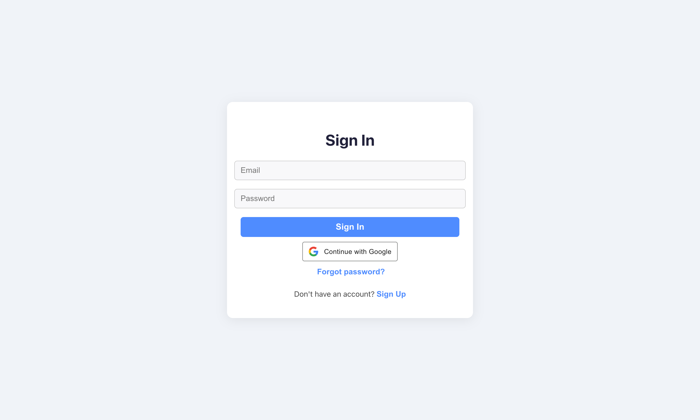
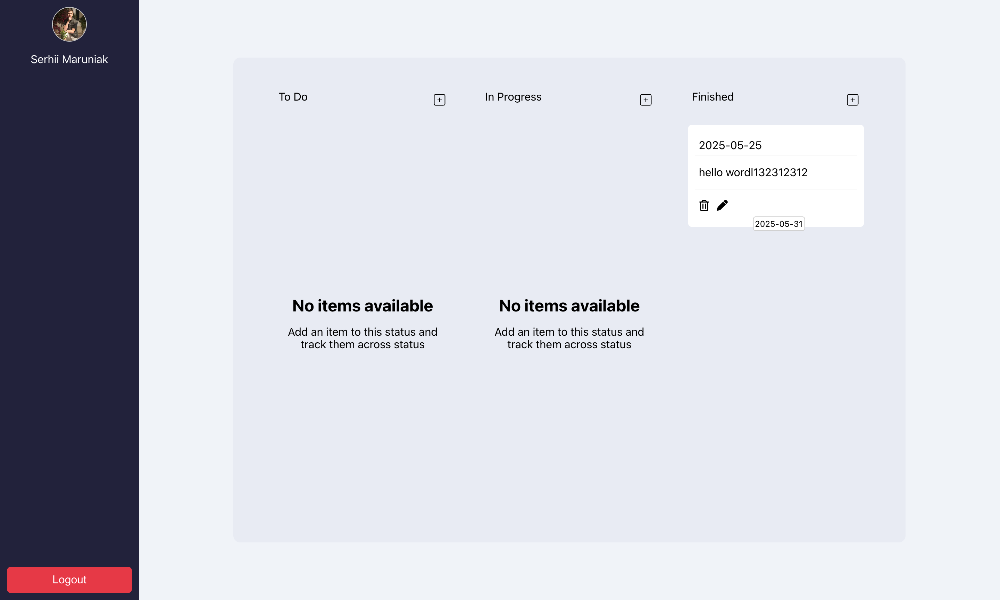

# Nemox Kanban Board

A fullstack Kanban board application built with React (frontend), Express (backend), PostgreSQL (database), and Drizzle ORM (migrations/ORM).  
Supports user authentication (email/password & Google), password reset, and drag-and-drop task management.




---

## Features

- User registration & login (email/password & Google OAuth)
- Email verification for signup
- Password reset via email
- Drag-and-drop Kanban board (To Do, In Progress, Finished)
- Per-user tasks
- Secure JWT authentication (cookies, httpOnly, sameSite)
- PostgreSQL database with Drizzle ORM migrations
- Production-ready CORS & cookie setup

---

## Project Structure

```
nemox-kanban-board/
│
├── client/         # React frontend
│   ├── src/
│   ├── public/
│   └── .env
│
├── server/         # Express backend
│   ├── drizzle/        # Drizzle ORM schema & migrations
│   │   ├── schema.ts
│   │   └── migrations/
│   ├── db.js
│   ├── email.js
│   ├── index.js
│   ├── drizzle.config.js
│   ├── .env
│   └── package.json
│
└── README.md
```

---

## Getting Started

### 1. **Clone the repository**

```sh
git clone <repo_name>
cd nemox-kanban-board
```

### 2. **Setup the backend**

```sh
cd server
cp .env.example .env   # Create your .env file with DB and secrets
npm install
```

**.env example:**

```
DB_USERNAME=your_db_user
DB_PASSWORD=your_db_pass
DB_HOST=your_db_host
DB_PORT=your_db_port
DB_DATABASE=your_db_name
JWT_SECRET=your_jwt_secret
EMAIL_USER=your_gmail@gmail.com
EMAIL_PASSWORD=your_gmail_app_password
GOOGLE_CLIENT_ID=your_google_client_id
GOOGLE_CLIENT_SECRET=your_google_client_secret
REMOTE_SERVER_LINK=https://your-backend-url
REMOTE_FRONTEND_LINK=https://your-frontend-url
NODE_ENV=development
```

**Run migrations:**

```sh
npm run drizzle:generate
npm run drizzle:migrate
```

**Start backend:**

```sh
npm run dev
```

---

### 3. **Setup the frontend**

```sh
cd ../client
cp .env.example .env   # Create your .env file
npm install
```

**.env example:**

```
REACT_APP_BACKEND_REMOTE_LINK=https://your-backend-url
```

**Start frontend:**

```sh
npm start
```

---

## Deployment

- **Frontend:** Deploy `/client` to Vercel, Netlify, etc.
- **Backend:** Deploy `/server` to Render, Railway, or your own server.
- **Database:** Use a managed PostgreSQL (Aiven, Supabase, Render, etc).

---

## Environment Variables

- **Frontend:**  
  `REACT_APP_BACKEND_REMOTE_LINK` — URL of your deployed backend

- **Backend:**  
  See `.env.example` above for all required variables.

---

## Migrations

- Edit your schema in `server/drizzle/schema.ts`
- Generate migration:  
  `npm run drizzle:generate`
- Apply migration:  
  `npm run drizzle:migrate`

---

## CORS & Cookies

- CORS is configured to allow both local and deployed frontends.
- All auth uses `httpOnly`, `secure`, `sameSite=none` cookies for security.

---

## License

[MIT License](LICENSE)

---

## Acknowledgements

- [Drizzle ORM](https://orm.drizzle.team/)
- [React](https://react.dev/)
- [Express](https://expressjs.com/)
- [PostgreSQL](https://www.postgresql.org/)
